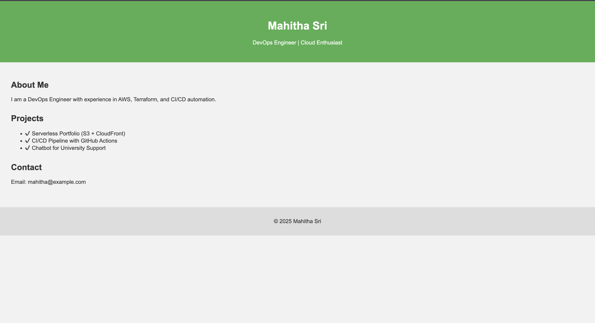

## Hosting a static website (HTML/CSS or React) using S3 + CloudFront + SSL (HTTPs) using AWS Free Tier.
### Step-by-Step Guide (AWS Console or CLI)
### Step1: Prepare Your Static Site Files
#### [index.htmlfile](index.html)
#### [style.css](script.js)
#### [script.css](script.js)
### Step2: Create and Configure S3 Bucket
#### Using AWS Console:
1. Go to S3 > Click Create bucket

2. Bucket name: Must be unique (e.g., portfolio-s3-mahitha)

3. Region: Choose any (us-east-1 preferred)

3. Uncheck “Block all public access” (important)

4. Click Create bucket
#### Enable Static Website Hosting:
1. Open the created bucket

2. Go to Properties

3. Scroll to Static website hosting

4. Click Edit > Enable

5. Index document: index.html

6. (Optional) Error document: error.html

7. Save changes
#### Upload Website Files:
1. Go to Objects > Click Upload

2. Add all files from your build folder

3. Upload them
### Step 3: Make S3 Bucket Public
#### Add a Bucket Policy:
1. Go to Permissions > Scroll to Bucket policy

2. Paste this policy (replace your-bucket-name):
```
{
  "Version": "2012-10-17",
  "Statement": [
    {
      "Sid": "AllowPublicRead",
      "Effect": "Allow",
      "Principal": "*",
      "Action": "s3:GetObject",
      "Resource": "arn:aws:s3:::your-bucket-name/*"
    }
  ]
}
```
3. Save
### Step 4: Create a CloudFront Distribution (CDN + HTTPS)
#### Using AWS Console:
1. Go to CloudFront > Click Create Distribution

2. Under Origin domain, choose your S3 Website endpoint

3. Looks like: your-bucket-name.s3-website-us-east-1.amazonaws.com

4. Not the one ending in amazonaws.com

5. Set Viewer protocol policy to Redirect HTTP to HTTPS

6. Set Default root object = index.html

7. Click Create distribution

### Wait for Deployment (~5–10 min)
Once done, CloudFront gives you a domain like this


